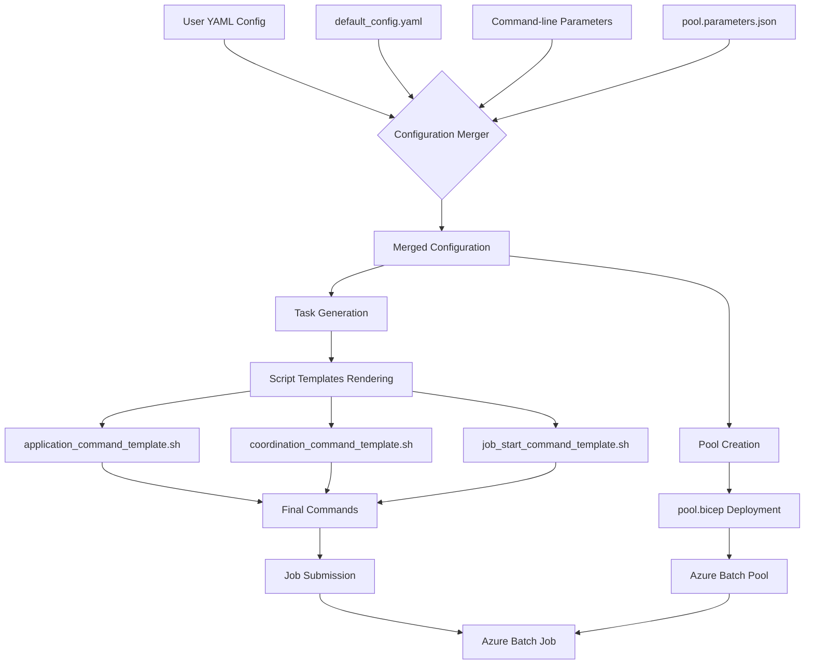
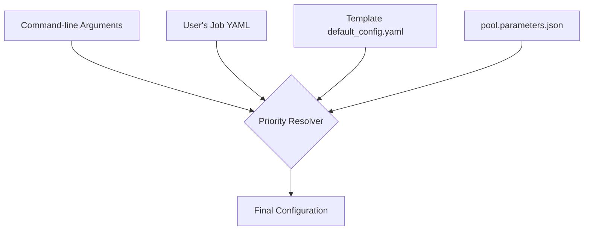
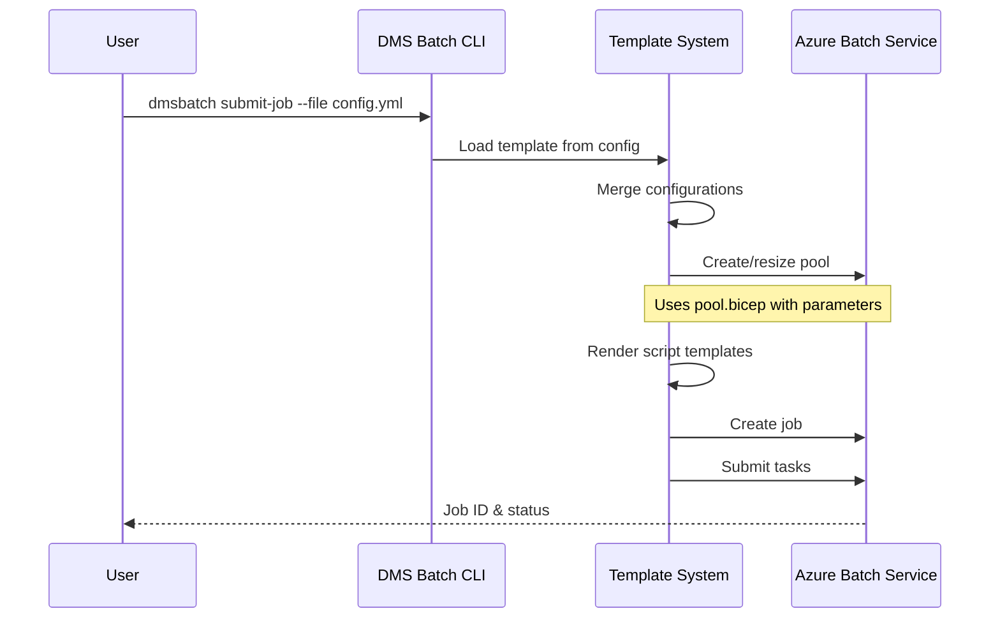

# Understanding the Template System in Azure DMS Batch

The Azure DMS Batch framework employs a template system that standardizes job submission while providing flexibility for different workloads. This document explains how templates are structured and processed.

> **Related Documentation:**
> - [Main Documentation](README.md) - General overview of the Azure DMS Batch framework
> - [Job YAML File Guide](README-batch-job-yaml.md) - How to write job configuration YAML files 
> - [Script Templates Details](README-script-templates.md) - In-depth explanation of script templates
> - [SCHISM-specific Configuration](README-schism-batch.md) - For SCHISM model workloads

## Visual Overview

### Template System Architecture



### Configuration Priority Flow



### Job Submission Process



## Template Directory Structure

Each template resides in a directory under `dmsbatch/templates` with the following structure:

```
dmsbatch/templates/<template_name>/
├── application_command_template.sh     # Main application execution script
├── autoscale_formula.txt               # Formula for pool auto-scaling (optional)
├── coordination_command_template.sh    # For MPI or multi-node tasks (optional)
├── default_config.yaml                 # Default configuration values
├── job_start_command_template.sh       # Setup commands for job start (optional)
├── pool.bicep                          # Azure Bicep template for pool creation
└── pool.parameters.json                # Parameters for pool creation
```

For more details on these script templates and how they're used, see the [Script Templates Documentation](README-script-templates.md).

## Configuration Hierarchy

The system uses a layered configuration approach:

1. Templates provide base configurations in `default_config.yaml`
2. User's job YAML file overrides template defaults
3. Command-line parameters can override both

For details on the specific parameters you can set in your job YAML file, refer to the [Job YAML Configuration Guide](README-batch-job-yaml.md).

## Template Components

### `default_config.yaml`

This file provides the foundation of each template, defining default values:

```yaml
# Basic job parameters
vm_size: "standard_d2s_v3"
num_hosts: 1
location: "eastus"
ostype: "windows"

# Application settings
command: "echo 'Default command'"
environment_variables:
  VAR1: "value1"

# Application packages to be installed
app_pkgs:
  - name: "dsm2"
    version: "8.2.c5aacef7"
    init_script: "set DSM2_HOME=%AZ_BATCH_APP_PACKAGE_dsm2%\\DSM2-8.2.c5aacef7-win32 & set PATH=%PATH%;%DSM2_HOME%\\bin"

# Pool and job configuration
pool_vm_size: "Standard_D2s_v3"
pool_vm_count: 1
```

### Script Templates

The framework uses several script templates that get rendered with values from the configuration:

#### `application_command_template[.sh|.bat]`

This script defines how the application runs:

```bash
#!/bin/bash
# Commands to set up environment
{{ENV_SETUP}}

# Execute the main application command
{{COMMAND}}
```

The `AzureBatch.wrap_cmd_with_app_path()` method combines these templates with the user's specified command and app packages, creating the final command that runs on the VM.

> For an in-depth look at how the application command is processed, see the [Script Templates Documentation](README-script-templates.md#application-command-template).

#### `coordination_command_template[.sh|.bat]` (for MPI jobs)

For multi-node tasks like MPI jobs, this template sets up coordination between nodes:

```bash
#!/bin/bash
# Set up MPI environment
export I_MPI_FABRICS=shm:tcp
export I_MPI_FALLBACK=0

# Wait for all nodes to be ready
{{COORDINATION_COMMANDS}}
```

> For details on MPI job configuration, see the [SCHISM-specific Documentation](README-schism-batch.md) which provides examples of multi-node workloads.

#### `job_start_command_template.sh/.bat`

This script runs when a job starts, typically setting up shared resources:

```bash
#!/bin/bash
# Download common files
{{SETUP_COMMANDS}}
# Move to shared directory
{{SHARED_SETUP}}
```

### Pool Creation with Bicep Templates

The `pool.bicep` file defines the Azure Batch pool infrastructure as code:

```bicep
// pool.bicep example
param vmSize string
param vmCount int
param appPackages array
param osImageReference object

resource batchPool 'Microsoft.Batch/batchAccounts/pools@2021-06-01' = {
  name: '${poolId}'
  properties: {
    vmSize: vmSize
    targetDedicatedNodes: vmCount
    virtualMachineConfiguration: {
      imageReference: osImageReference
      // Other properties...
    }
    applicationPackageReferences: appPackages
  }
}
```

The corresponding `pool.parameters.json` file provides default parameter values:

```json
{
  "$schema": "https://schema.management.azure.com/schemas/2019-04-01/deploymentParameters.json#",
  "contentVersion": "1.0.0.0",
  "parameters": {
    "vmSize": {
      "value": "Standard_D2s_v3"
    },
    "vmCount": {
      "value": 1
    },
    "osImageReference": {
      "value": {
        "publisher": "microsoftwindowsserver",
        "offer": "windowsserver",
        "sku": "2019-datacenter-core",
        "version": "latest"
      }
    }
  }
}
```

## Template Processing Flow

1. User submits job with `dmsbatch submit-job --file my_job_config.yml`
2. The framework loads the specified template from `template_name` parameter
3. It merges `default_config.yaml` with user's YAML file
4. For pool creation:
   - Loads `pool.parameters.json` 
   - Overrides parameters from yaml configuration
   - Applies configuration values
   - Deploys `pool.bicep` with these parameters
5. For job creation:
   - Renders script templates with configuration values
   - Submits tasks with these commands

For command-line usage details, see the [Job YAML Configuration Guide](README-batch-job-yaml.md#using-the-dmsbatch-submit-job-command).

## Priority of Configuration Values

When processing a template, the system prioritizes configuration values in this order:

1. Command-line arguments (highest priority)
2. User's job configuration YAML
3. Template's `default_config.yaml`
4. Pool parameters in `pool.parameters.json` (lowest priority)

This allows users to override only the specific parameters they need to change while inheriting sensible defaults from the template.
User defined variables in the YAML file can be referenced in the templates using the `{{VARIABLE_NAME}}` syntax. This is uses f-strings to substitute the values at runtime.

Note: in addition the user can define custom tags (that don't clash with the reserved keywords) in the YAML file. These tags can be used to pass custom values to the templates. For example, if you define a tag `my_custom_tag: "value"`, you can reference it in the template as `{{my_custom_tag}}`.
These tags are evaluated in the order of definition in the YAML file, so if you have multiple tags with the same name, the last one defined will be used. Also substitution is done in the order of definition in the template, so if you have a tag `my_custom_tag` defined in the YAML file and you reference it in the template, it will be replaced with the value from the YAML file.

## YAML Substitution Principles

The template system provides powerful variable substitution capabilities that allow for flexible and dynamic configuration. Here's how the substitution works:

### Basic Substitution

In script templates, placeholders enclosed in double curly braces (`{{VARIABLE_NAME}}`) are replaced with values from the configuration dictionary. For example:

```bash
#!/bin/bash
echo "Running job {{job_name}} on {{num_hosts}} hosts"
```

When processed, these placeholders are substituted with the actual values from the merged configuration.

### Recursive Substitution

The system performs recursive substitution, meaning that variables can reference other variables. The substitution process evaluates references in the order they appear in the YAML file, allowing for complex value chains:

```yaml
# User YAML file
base_dir: "/data"
input_dir: "{{base_dir}}/inputs"
output_dir: "{{base_dir}}/outputs"
```

In this example, `input_dir` and `output_dir` both reference `base_dir`, and their values will be resolved to `/data/inputs` and `/data/outputs` respectively.

### Custom Tag Processing

Users can define custom tags in their YAML configuration that don't conflict with reserved keywords. These custom tags follow the same substitution rules as standard configuration values:

1. **Definition**: Add your custom tag anywhere in the YAML configuration:
   ```yaml
   my_custom_tag: "custom_value"
   another_tag: "value based on {{my_custom_tag}}"
   ```

2. **Usage**: Reference these tags in script templates using the double curly brace syntax:
   ```bash
   #!/bin/bash
   echo "My custom value is: {{my_custom_tag}}"
   echo "Another tag is: {{another_tag}}"
   ```

3. **Substitution Order**: Tags are processed in the order they appear in the YAML file. If multiple tags with the same name exist, the last one defined takes precedence.

4. **Nested References**: Custom tags can reference other tags, including standard configuration values:
   ```yaml
   job_name: "sample_job"
   my_path: "/jobs/{{job_name}}"
   custom_command: "process --input={{my_path}}/input.dat"
   ```

### Substitution in Template Paths

Template paths themselves can contain substitution variables:

```yaml
application_command_template: 'templates/{template_name}/application_command_template.sh'
```

This allows the system to dynamically determine which templates to use based on the configuration.

### Best Practices for YAML Substitution

1. **Avoid Circular References**: Ensure your variable references don't create circular dependencies.

2. **Use Descriptive Names**: Choose clear and descriptive names for custom tags to improve readability.

3. **Keep It Simple**: While nested references are powerful, excessive nesting can make configurations difficult to understand and debug.

4. **Test Thoroughly**: When creating configurations with complex substitutions, test them thoroughly to ensure all references are resolved correctly.

5. **Document Custom Tags**: Document any custom tags that others might need to use when working with your templates.

## Resource Management

The template system handles:
- Application package references with environment variable setup
- Resource file specifications for input/output
- Environment variable definitions
- Task dependencies and coordination

For examples of input/output file specifications, see the [Job YAML Configuration Guide](README-batch-job-yaml.md#inputoutput-file-specifications). For application package details, refer to the [Script Templates Documentation](README-script-templates.md#application-package-integration).

## Benefits

This template-based architecture allows users to:
1. Use pre-configured templates for common workloads (DSM2, SCHISM, etc.)
2. Override only the parameters they need to change
3. Create new templates for specialized workflows

The system significantly reduces the amount of boilerplate code and configuration needed while maintaining flexibility for different types of batch computing workloads.

## See Also

- [Main Documentation](README.md) - Overview and installation
- [Job YAML Configuration Guide](README-batch-job-yaml.md) - How to write job configuration YAML files
- [Script Templates Documentation](README-script-templates.md) - Details on script templates
- [SCHISM-specific Configuration](README-schism-batch.md) - For SCHISM model workloads
- [SCHISM Inline Processing](README-schism-batch-inlineprocessing.md) - For SCHISM inline processing