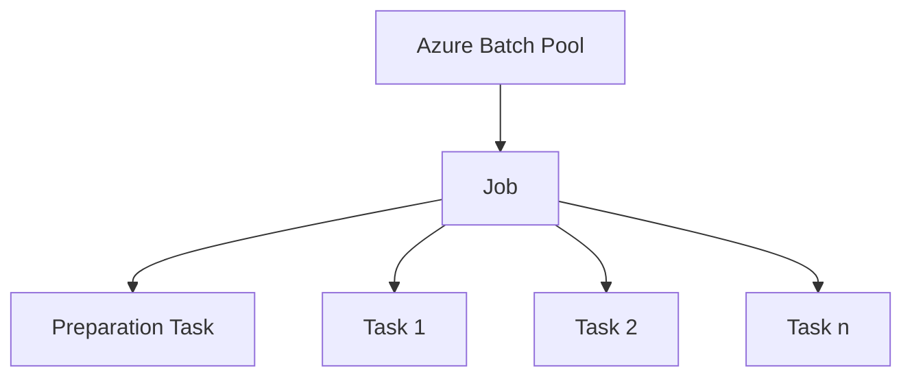
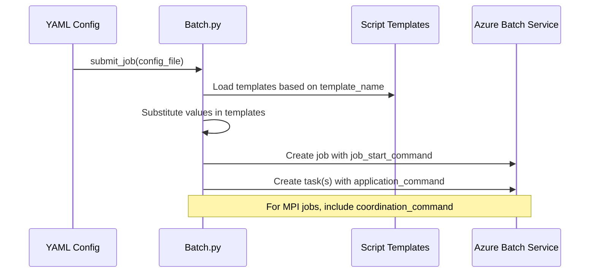

# Script Templates in Azure DMS Batch

This document explains how script templates are used within the Azure DMS Batch framework to create jobs and tasks. These templates provide the foundation for executing commands on Azure Batch compute nodes.

## Overview of Azure Batch Jobs and Tasks

In Azure Batch, a **job** is a collection of **tasks** that run on compute nodes (VMs) in a **pool**. The Azure DMS Batch framework uses a template system to abstract and simplify this process.



## Script Template Files

The Azure DMS Batch framework uses several script template files to define different aspects of job and task execution:

1. **job_start_command_template.sh/.bat** - Commands that run when a job starts
2. **application_command_template.sh/.bat** - Commands that execute the main application
3. **coordination_command_template.sh/.bat** - Commands for multi-node tasks (like MPI jobs)

These templates contain placeholders that get replaced with values from the configuration during job submission.

## Template Processing Flow

When submitting a job using the `submit_job` function, the following happens:



## Job Start Command Template

The `job_start_command_template.sh/.bat` file contains commands that are executed when a job starts. This is used to set up the environment for all tasks in the job.

```bash
#!/bin/bash
# Commands to set up shared resources and environment
{{SETUP_COMMANDS}}
# Move to shared directory
{{SHARED_SETUP}}
```

In the code, this template is processed in the `submit_task` function:

```python
job_start_command_template = local_config_dict["job_start_command_template"]
job_cmd = load_command_from_resourcepath(fname=job_start_command_template)
job_cmd = job_cmd.format(**local_config_dict)
```

The formatted command is then used to create a preparation task for the job:

```python
prep_task = client.create_prep_task(
    f"job_prep_task", job_cmd, ostype=ostype, resource_files=job_resource_files
)
client.create_job(job_name, pool_name, prep_task, max_task_retry_count=max_task_retry_count)
```

## Application Command Template

The `application_command_template.sh/.bat` file contains the main commands that each task will execute:

```bash
#!/bin/bash
# Commands to set up environment
{{ENV_SETUP}}

# Execute the main application command
{{COMMAND}}
```

In the code, this template is processed for each task:

```python
application_command_template = config_dict["application_command_template"]
app_cmd = load_command_from_resourcepath(fname=application_command_template)
app_cmd = app_cmd.format(**config_dict)
```

For Windows tasks, an additional step encodes the commands as base64 to ensure proper execution:

```python
if ostype == "windows":
    # Encode the commands as base64
    encoded_commands = base64.b64encode(app_cmd.encode("utf-8")).decode("utf-8")
    app_cmd = 'powershell -Command "...'
```

The applicaton command defers to the "command" key in the configuration, which is expected to be a string or list of strings. If it's a list, each command is joined with `&&` for execution.

```yaml
command: |
  echo "Running application..."
  ./my_application --input data.txt --output result.txt
```

For mpi jobs use mpi_comand key in the configuration. The framework will automatically set up the environment that has an MPI cluster. The `mpi_command` key in the configuration is used to specify the MPI command to be executed:

```yaml
mpi_command: |
  mpirun -n 4 ./my_mpi_application --input data.txt --output result.txt
```


## Coordination Command Template

For multi-node tasks like MPI jobs, the `coordination_command_template.sh/.bat` file defines how nodes coordinate:

```bash
#!/bin/bash
# Set up MPI environment
export I_MPI_FABRICS=shm:tcp
export I_MPI_FALLBACK=0

# Wait for all nodes to be ready
{{COORDINATION_COMMANDS}}
```

This template is used when the configuration includes an `mpi_command`:

```python
if "mpi_command" in config_dict:
    coordination_command_template = config_dict["coordination_command_template"]
    coordination_cmd = load_command_from_resourcepath(fname=coordination_command_template)
    coordination_cmd = coordination_cmd.format(**config_dict)
    coordination_cmd = client.wrap_commands_in_shell([coordination_cmd], ostype=ostype)
```

When creating the task, the coordination command is included for multi-node tasks:

```python
if coordination_cmd is not None:
    task = client.create_task(
        task_name,
        app_cmd,
        num_instances=num_hosts,
        coordination_cmdline=coordination_cmd,
        # Other parameters...
    )
```

## Application Package Integration

Application packages are deployed to Azure Batch and referenced in scripts. The framework builds setup commands for these packages using `build_app_pkg_scripts`:

```python
def build_app_pkg_scripts(config_dict):
    if "app_pkgs" in config_dict:
        app_pkgs = config_dict["app_pkgs"]
        app_pkg_scripts = [
            app_pkg["init_script"] for app_pkg in app_pkgs if "init_script" in app_pkg
        ]
        return "\n".join(app_pkg_scripts)
    else:
        return ""
```

These commands are added to the configuration as `app_pkgs_script` and can be referenced in templates.

## Template Substitution

The framework uses Python's string formatting to substitute values in templates:

```python
def create_substituted_dict(config_dict, **kwargs):
    config_dict = config_dict.copy()
    config_dict.update(kwargs)
    return substitute_values(config_dict)
```

The `substitute_values` function handles recursive formatting of strings within the configuration.

## Task Submission

Finally, tasks are assembled and submitted to Azure Batch in batches:

```python
tasks.append(task)
if len(tasks) == 100:
    try:
        client.submit_tasks(job_name, tasks, auto_complete=False)
        tasks = []
    except BatchErrorException as e:
        print(e)
        raise e
```

## Best Practices for Script Templates

1. **Parameterize Everything**: Use placeholders for values that might change.
2. **Error Handling**: Include error handling in scripts to make debugging easier.
3. **Environment Setup**: Always set up the environment before running commands.
4. **Output Capture**: Redirect output to files for monitoring and debugging.
5. **Exit Codes**: Return appropriate exit codes to signal success or failure.

## Example: Complete Template Flow

Here's how the templates are processed for a typical job:

1. YAML configuration specifies template name, commands, and parameters
2. Framework loads default configuration from template's `default_config.yaml`
3. Values are merged with user configuration
4. Job start command template is loaded and formatted with configuration values
5. Application command template is loaded and formatted for each task
6. For MPI jobs, coordination command template is also loaded and formatted
7. Job and tasks are created in Azure Batch with these commands

This template-based approach allows for flexible and customizable batch job submission while maintaining consistency across different types of workloads.